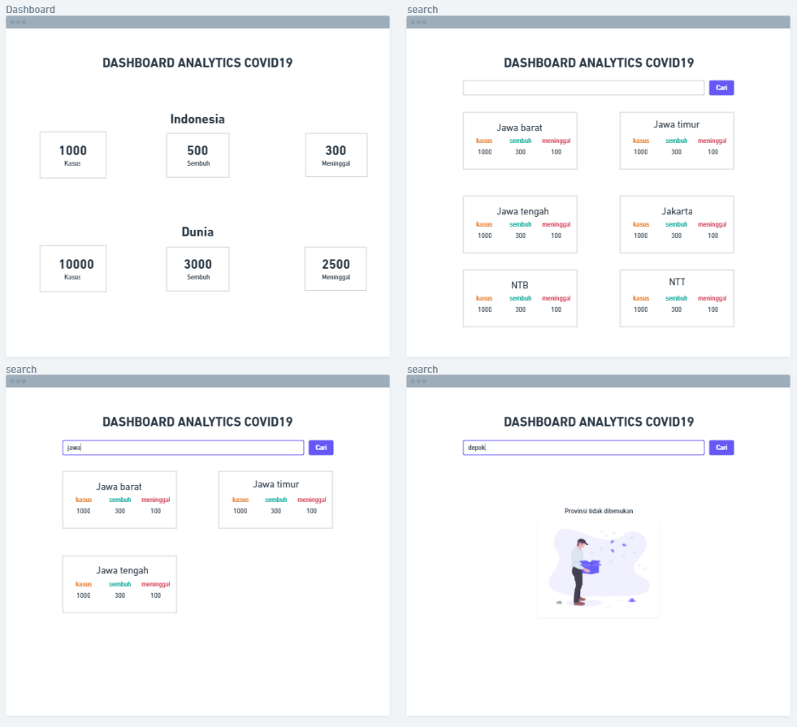

Ini adalah tugas yang harus dikerjakan oleh Peserta Bootcamp sebelum masuk ke dalam materi React Js dan dikerjakan sesudah materi Asynchronous ( Fetch API )

### Objective:

- Mengetahui level pemahaman peserta untuk stage 1
- Memfasilitasi peserta membuat sebuah web portfolio
- Mentor dapat memberikan review dan feedback kepada setiap peserta

Tugas ini bersifat Project, yang dikerjakan oleh per individu.

## Assignment

Buatlah sebuah Website yang menampilkan data dari External API/3rd Party API Kawal Corona dengan min harus terdapat halaman :

- Home
    - Summary total data covid (kasus, sembuh, meninggal) di Indonesia/Dunia
- Search Page by Province/Country
    - Menampilkan keseluruhan data province/country
    - Terdapat inputan untuk melakukan pencarian
    - Jika ditemukan, seluruh data diganti dengan data yg dicari
    - Jika tidak ditemukan, seluruh data diganti dengan not found
    

Berikut kerangka tampilan yg dapat di jadikan sebagai referensi

**Kriteria penilaian** berdasarkan ketentuan sebagai berikut :

- Gunakan semantic HTML (5%)
- Menggunakan Styling CSS / Bootstrap / Tailwind (20%)
- Harus Mobile Responsive (15%)
- Gunakan **`function`** untuk menyimpan statement/perintah dari fitur yang dibutuhkan (5%)
- Gunakan **`fetch`** untuk mendapatkan data dari API (silahkan gunakan promise/async await) (10%)
- Gunakan Looping untuk mengakses data array satu per satu sebelum data di tampilkan (10%)
- Tampilkan seluruh data yang diambil menggunakan DOM(Document Object Model) (25%)
- Jika data ditemukan, perbarui data yang di tampilkan menggunakan DOM. Jika tidak ditemukan, munculkan keterangan data tidak ditemukan atau illustrasi image (https://undraw.co) (10%)

Ketentuan tugas:

- API  :
  - page home:
      - indonesia: [https://covid19.mathdro.id/api/countries/Indonesia](https://covid19.mathdro.id/api/countries/Indonesia/confirmed)
      - global: [https://covid19.mathdro.id/api/](https://covid19.mathdro.id/api/)
  - page search: [https://covid19.mathdro.id/api/confirmed](https://covid19.mathdro.id/api/confirmed)
- Publish website portofolio ke Netlify
- Terindikasi plagiat akan diberi nilai 0

Kamu bebas untuk menambahkan Halaman lain atau Fitur lainnya sekreatif mungkin

# Benchmark Scoring

60 - 70 : Kemampuan peserta mendekati standar dan **membutuhkan** mentoring tambahan

70 - 80 : Kemampuan peserta sudah cukup baik dan perlu dipertajam lagi

80 - 100 : Peserta sudah menguasai materi yang dipelajari dan mampu explorasi mandiri